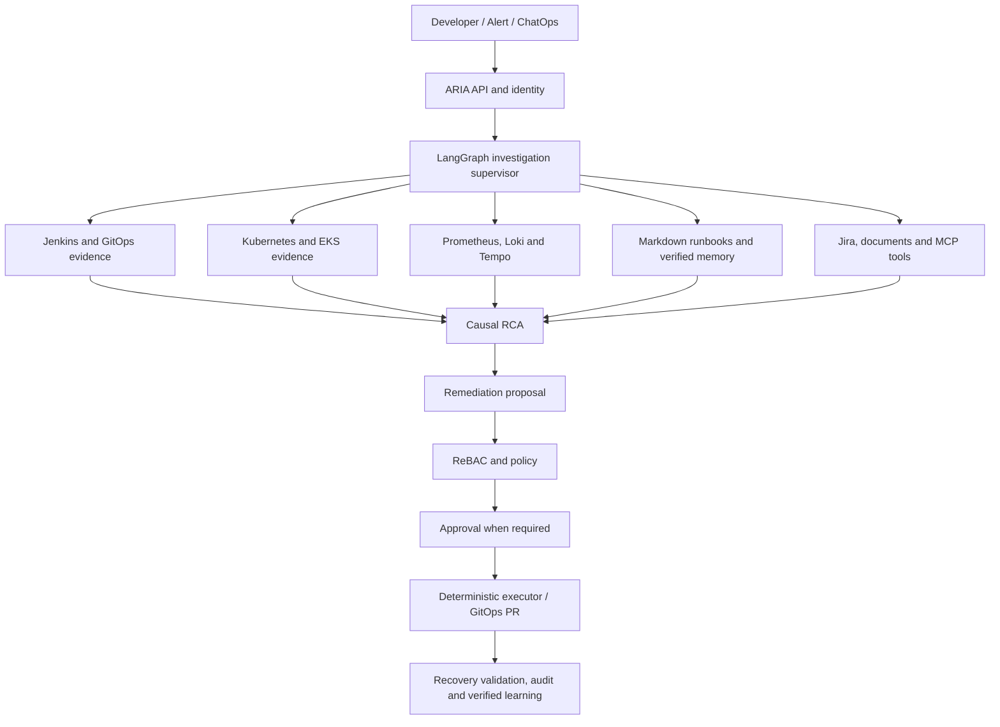

# Incident Investigator: Open-Source AI-SRE Runbook + Self-Healing Platform

## Latest production hardening updates

This version closes the approval-to-execution loop and removes the unsafe demo-secret pattern. Run `make bootstrap-env` before local use; it generates a requester token, an incident-commander approver token, and an Alertmanager HMAC secret in `.env`. The requester token can create healing approvals, but a separate approver token must approve them. Approval queues a Celery task, and the worker executes the Kubernetes action asynchronously.

Key safety behaviors:

- Request/approval actors come from the authenticated token, not request-body fields.
- Prod healing actions require approval.
- The same user cannot request and approve the same action.
- Approved actions are queued and executed asynchronously by the worker.
- Approved actions execute exactly once.
- Alertmanager webhooks require HMAC validation.
- Alembic now includes an initial schema migration.

Example approval flow:

```bash
make heal-scale ENVIRONMENT=prod
# copy approval_id from the response
make approve-action APPROVAL_ID=1
# the API queues the execution task; the Celery worker performs the Kubernetes action
```


This repository is a local-first, GitHub-ready AI-SRE project that demonstrates how to investigate Kubernetes incidents using open-source observability, RAG runbooks, and controlled self-healing automation.

ARIA now also includes a Kubernetes telemetry data plane under `telemetry/`: OpenTelemetry node agents and gateways, Kafka-compatible buffering, Vector processing, scalable storage profiles, pipeline dashboards, load/failure scenarios, capacity planning, and a recommendation-only telemetry intelligence agent. See `docs/architecture/TELEMETRY_DATA_PLANE.md` and `docs/TELEMETRY_IMPLEMENTATION_STATUS.md`.

The featured end-to-end demo uses a fictional Canadian bank—MapleTrust Bank—with an instrumented banking → fraud detection → transaction ledger request path. It provides W3C context propagation, trace-correlated JSON logs, Prometheus exemplars, span-derived RED metrics, and Grafana links between Prometheus, Loki, and Tempo. It is not affiliated with CIBC, RBC, or another real bank. See `docs/END_TO_END_OBSERVABILITY_DEMO.md`.

It is designed for SRE, DevOps, Platform Engineering, AIOps, DevSecOps, and LLMOps interviews.

## AI architecture and operating model

ARIA correlates developer reports, CI/CD, changes, Kubernetes/EKS state, telemetry, security signals, Markdown runbooks and verified incident memory. AI produces evidence and recommendations; deterministic systems own mutations.



Canonical AI assets:

- [`docs/runbooks/`](docs/runbooks/README.md): version-controlled RAG corpus.
- [`docs/architecture/`](docs/architecture/ARIA_SYSTEM_ARCHITECTURE.md): platform architecture.
- [`docs/security/`](docs/security/ARIA_THREAT_MODEL.md): trust boundaries.
- [`skills/`](skills/): portable ChatGPT/Codex, Claude and compatible-agent skills.
- [`AGENTS.md`](AGENTS.md) and [`CLAUDE.md`](CLAUDE.md): repository-wide agent rules.

Portable skills: `aria-investigate-incident`, `aria-author-runbook`, and `aria-add-mcp-connector`. MCP is a transport, not an authorization boundary; connectors start read-only and mutations remain governed.

## What this project does

```text
Kubernetes app incident
    ↓
Prometheus / logs / Kubernetes events
    ↓
Incident Investigator API
    ↓
RAG runbook retrieval
    ↓
Recommended remediation
    ↓
Policy check
    ↓
Optional self-healing action
    ↓
Recovery validation
```

## Open-source stack

| Layer | Tool |
|---|---|
| Local Kubernetes | Kind |
| Containers | Docker |
| Metrics | Prometheus |
| Dashboards | Grafana |
| Alerting | Alertmanager |
| Paging / On-call | GoAlert |
| Logs | Elasticsearch + Logstash + Kibana optional, Loki optional |
| RAG API | FastAPI |
| Vector DB | ChromaDB |
| Local LLM option | Ollama |
| Embeddings | Sentence Transformers |
| Policy validation | YAML policy engine, OPA-ready design |
| Self-healing | Kubernetes Python client |

## Repository layout

```text
incident-investigator/
├── apps/sample-checkout-api/          # Demo app used to generate incidents
├── server/                            # Investigator + RAG + healing API
├── docs/                              # Runbooks, RCA, SOP, architecture notes
├── k8s/                               # Kind, apps, monitoring, paging manifests
├── scripts/                           # Bootstrap, ingest, test, incident scripts
├── examples/                          # Sample payloads
├── tests/                             # Basic tests
├── docker-compose.yml                 # Local non-K8s mode
├── Makefile                           # Common commands
└── README.md
```

## Prerequisites

Install these once:

```bash
brew install docker kind kubectl helm make jq
```

Also install Docker Desktop and keep it running.

Optional local LLM:

```bash
brew install ollama
ollama serve
ollama pull llama3.1:8b
```

The project works without Ollama. If no LLM endpoint is configured, it returns deterministic investigation output from retrieved runbooks.

## Quick start: local Docker mode

This mode is easiest and works without Kubernetes.

```bash
git clone <your-repo-url>
cd incident-investigator
make local-up
make ingest
make sample-investigation

# Local auth is generated by `make bootstrap-env`; do not commit `.env`.
# Override it with: make sample-investigation API_TOKEN=<your-token>
```

Open:

```text
API: http://localhost:8080/health
Chroma: http://localhost:8000
Sample App: http://localhost:9000/health
```

## Quick start: Kubernetes mode

```bash
make kind-create
make k8s-bootstrap
make k8s-deploy-app
make ingest
make port-forward
```

Then in another terminal:

```bash
make sample-investigation
```

## API examples

### Health

```bash
curl http://localhost:8080/health
```

### Ask the RAG runbook assistant

```bash
curl -s http://localhost:8080/rag/ask \
  -H 'Content-Type: application/json' \
  -H 'Authorization: Bearer $API_AUTH_TOKEN' \
  -d '{"question":"checkout-api has high latency and increased 5xx after deployment. What should I check?","user":{"role":"sre","team":"payments"}}' | jq
```

### Investigate an incident

```bash
curl -s http://localhost:8080/investigate \
  -H 'Content-Type: application/json' \
  -H 'Authorization: Bearer $API_AUTH_TOKEN' \
  -d @examples/high-latency-incident.json | jq
```

### Execute a safe self-healing action

Dry run:

```bash
curl -s http://localhost:8080/heal \
  -H 'Content-Type: application/json' \
  -H 'Authorization: Bearer $API_AUTH_TOKEN' \
  -d '{"action":"scale_deployment","namespace":"demo","target":"checkout-api","replicas":3,"environment":"dev","dry_run":true,"user":{"role":"sre","team":"payments"}}' | jq
```

Real execution in local Kind:

```bash
curl -s http://localhost:8080/heal \
  -H 'Content-Type: application/json' \
  -H 'Authorization: Bearer $API_AUTH_TOKEN' \
  -d '{"action":"scale_deployment","namespace":"demo","target":"checkout-api","replicas":3,"environment":"dev","dry_run":false,"user":{"role":"sre","team":"payments"}}' | jq
```

## Security

Protected endpoints require `Authorization: Bearer $API_AUTH_TOKEN` by default. Alertmanager webhooks require an `X-Incident-Signature` HMAC header. See `docs/SECURITY_HARDENING.md`.

## Incident scenarios to demo

### 1. High latency

```bash
make generate-latency
make sample-investigation
```

### 2. Pod crash

```bash
make kill-pod
make sample-investigation
```

### 3. Scale recovery

```bash
make heal-scale
```

## Paging / on-call

This repo includes GoAlert manifests under `k8s/paging/`. GoAlert is a PagerDuty-style open-source on-call and escalation tool that can receive alerts from Alertmanager.

Deploy it locally:

```bash
make paging-install
```

Port-forward:

```bash
kubectl -n paging port-forward svc/goalert 8081:8081
```

Open:

```text
http://localhost:8081
```

For production-grade setups, use a real database and secure secrets instead of the local demo configuration.

## Security model

This project intentionally does not let the LLM directly run commands.

```text
LLM recommendation
    ↓
Structured action request
    ↓
Policy validator
    ↓
RBAC/ReBAC filter
    ↓
Dry-run / approval
    ↓
Executor
    ↓
Recovery validation
```

## Interview story

Use this summary:

> I built an open-source AI-SRE incident investigation platform on Kubernetes. It collects incident context from metrics, logs, traces, and Kubernetes events, retrieves relevant runbooks and RCA documents using RAG, applies RBAC/ReBAC filters before retrieval, recommends remediation steps, and executes only policy-approved self-healing actions through Kubernetes APIs. The design prevents direct LLM command execution and includes dry-run validation, approval gates, and post-healing verification.

## Roadmap

- Add OPA/Gatekeeper policy checks
- Add Loki or full ELK deployment profile
- Add Jaeger/Tempo tracing
- Add Argo CD rollback action
- Add LitmusChaos experiments
- Add LangGraph multi-agent flow
- Add OpenFGA/SpiceDB ReBAC model
- Add Slack/MS Teams notification integration

---

## AI-Native Repo Support

This repository includes built-in context files for Claude, Cursor, and other AI coding agents:

| File/Folder | Purpose |
|---|---|
| `CLAUDE.md` | Claude project context and safety rules |
| `AGENTS.md` | General AI coding agent instructions |
| `.cursor/rules/` | Cursor project rules |
| `.claude/skills/incident-investigator/` | Claude skill workflow |
| `docs/ai-native/` | How to use AI tools with this repo |
| `prompts/` | Reusable prompts for common repo tasks |

Recommended AI prompt:

```text
Read CLAUDE.md and AGENTS.md first. Then inspect only the files required for this task. Keep self-healing policy-controlled and add tests.
```

This prevents the AI from rereading the entire codebase and keeps changes aligned with the project architecture.

## AI Incident War Room Flow

The repo now includes an incident command-center workflow. When an alert is received, the API can create a simulated incident channel, post an AI teammate opening update, run initial investigation, retrieve matching runbooks through RAG, maintain a timeline, and generate an RCA draft.

Run it locally:

```bash
make local-up
make ingest
make sample-intake
make sample-timeline
make sample-rca
```

Important files:

```text
server/collaboration/              # AI war-room and incident collaboration layer
docs/collaboration/AI_WAR_ROOM.md  # Architecture and operating model
docs/gaps/WORKFLOW_GAP_CHECKLIST.md # Missing pieces and next roadmap
examples/alertmanager-intake.json  # Sample alert payload
```

Current mode is safe local simulation. It does not create real Slack channels yet. For production-style usage, add a Slack or Mattermost provider inside `server/collaboration/notification_router.py` and `server/collaboration/channel_manager.py`.


## v2 Production-Grade Additions

This repo now includes the full AI-native incident command workflow:

- Real Alertmanager webhook parser: `POST /webhooks/alertmanager`
- PostgreSQL-backed incident store
- Incident state machine
- Persistent timeline, RCA drafts, approvals, actions, and audit logs
- Mattermost/Slack adapter pattern
- Redis + Celery worker scaffolding
- Event bus abstraction
- Approval engine for risky remediation
- OpenTelemetry instrumentation hook
- LitmusChaos Kubernetes incident generator

### Fast local path

```bash
make local-up
make ingest
make sample-alertmanager
```

### With open-source collaboration

```bash
make local-up-collab
```

Mattermost runs at `http://localhost:8065`. Create a bot token and set:

```bash
COLLABORATION_PROVIDER=mattermost
MATTERMOST_URL=http://localhost:8065
MATTERMOST_TOKEN=<token>
MATTERMOST_TEAM_ID=<team-id>
```

### Kubernetes chaos demo

```bash
make kind-create
make k8s-bootstrap
make k8s-deploy-app
make chaos-install
make chaos-pod-delete
make chaos-cpu-hog
```

Read these docs next:

- `docs/architecture/PRODUCTION_WORKFLOW.md`
- `docs/intake/ALERTMANAGER_WEBHOOK.md`
- `docs/collaboration/MATTERMOST_AND_SLACK.md`
- `docs/database/POSTGRES_SCHEMA.md`
- `docs/chaos/LITMUSCHAOS_GUIDE.md`
## Enterprise ReBAC + Confluence/Wiki RAG

This version includes a local ReBAC layer and a Confluence/wiki connector.

### ReBAC

Local demo relationships live in:

```text
server/authz/relationships.yaml
```

The authorization model is:

```text
user -> team -> service -> incident/runbook/action
```

RAG retrieval, incident timeline access, RCA access, incident intake, and healing actions are filtered by service relationships.

OpenFGA starter files are included under:

```text
infra/openfga/model.fga
infra/openfga/tuples.yaml
```

### Confluence/Wiki Ingestion

Local sample pages live in:

```text
examples/confluence/pages.json
```

Sync them into ChromaDB:

```bash
make confluence-sync
```

For real Confluence:

```bash
export CONFLUENCE_BASE_URL="https://your-company.atlassian.net"
export CONFLUENCE_EMAIL="you@company.com"
export CONFLUENCE_API_TOKEN="..."
export CONFLUENCE_SPACE="SRE"
make confluence-sync
```

Then ask RAG with ReBAC filtering:

```bash
make sample-rag-rebac
```

---

## Enterprise AI-Native Integrations Added

This repo now includes optional adapter boundaries and local run targets for:

- Ollama for local LLM reasoning
- Argo CD for GitOps sync/rollback integration
- Argo Rollouts for canary promote/abort workflows
- OpenFGA production ReBAC migration path
- Prometheus, Loki, and Tempo evidence adapters
- Mattermost/Slack collaboration adapters
- Falco runtime security alert intake
- Cilium/Hubble service topology boundary
- KEDA event-driven scaling recommendations
- OpenCost cost-aware remediation context

These integrations are intentionally optional and degrade gracefully. The core incident platform must still run if any optional backend is unavailable.

### Run with AI/authorization/observability profiles

```bash
make bootstrap-env
make local-up-ai
make ollama-pull
make ingest
make confluence-sync
make sample-llm-reason
make observability-query
```

### GitOps and rollout integration

```bash
make argocd-install
make rollouts-install
make argocd-apps
```

### Runtime security and scaling integrations

```bash
make falco-install
make sample-falco
make keda-install
make keda-recommend
make opencost-install
make cost-allocation
```

### OpenFGA migration

```bash
make openfga-notes
```

Local development still uses `server/authz/relationships.yaml`. Production should move tuples and checks to OpenFGA.

## Updated Safety Contract

```text
LLM / Ollama can reason and recommend
  -> ReBAC checks ownership
  -> Policy validates action
  -> Approval workflow gates risky changes
  -> Celery executes deterministic adapter
  -> Timeline and audit log persist result
```

Never execute infrastructure changes directly from LLM-generated text.

## Enterprise tool hardening update

The AI-native enterprise tool layer is now safety-gated:

- `/llm/reason` respects `LLM_ENABLED=false`.
- Argo CD sync with `dry_run=false` creates an approval instead of mutating directly.
- Argo Rollouts promote/abort are explicit dry-run stubs until a real executor is implemented.
- Falco webhook uses HMAC validation with `FALCO_WEBHOOK_SECRET`.
- OpenFGA can be used through `REBAC_BACKEND=openfga`; local YAML remains the fallback.
- OpenCost namespace queries are ReBAC-gated.

See `docs/enterprise-tools-hardening.md`.

## Chaos Engineering with LitmusChaos

The platform now includes a LitmusChaos-backed resilience engineering layer. This lets you intentionally inject failures and validate the full incident workflow.

```text
LitmusChaos -> Alert/Incident -> AI Investigation -> ReBAC RAG -> Approval/Healing -> Resilience Report
```

Safe dry-run first:

```bash
make chaos-list
make chaos-run-dry EXPERIMENT=pod-delete
make chaos-validate EXPERIMENT=pod-delete
make chaos-report EXPERIMENT=pod-delete
```

Live Kubernetes sandbox run:

```bash
make kind-create
make k8s-bootstrap
make k8s-deploy-app
make chaos-install
make chaos-run-live EXPERIMENT=pod-delete
```

Supported experiments:

- `pod-delete`
- `cpu-hog`
- `memory-hog`
- `network-latency`
- `dns-failure`

Chaos execution is authenticated, ReBAC-gated by service/namespace, and dry-run by default.

## Full Maturity Layers Added

This version also includes the final maturity scaffolding:

- Multi-agent incident investigation (`/agents/investigate`)
- SLO/error-budget evaluation (`/slo/evaluate`)
- Operational memory (`/memory/record`, `/memory/{service}`)
- Deployment/change correlation (`/deployment/correlate`)
- ChatOps command parsing (`/chatops/parse`)
- Production hardening checklist

Safe run commands:

```bash
make agent-investigate
make slo-evaluate
make deployment-correlate
make memory-record
make memory-recall
make chatops-parse
```

These layers are intentionally safe by default. They can recommend and summarize, but they do not bypass ReBAC, policy validation, approval, or async execution.


## Full-maturity hardening notes

- Chaos is disabled by default. Set `CHAOS_ENABLED=true` only in a sandbox cluster.
- Multi-agent investigations run agents in parallel but preserve stable response ordering.
- Operational memory is now persisted through the database when a DB session is available.
- Chaos validation APIs use an explicit request-to-engine contract instead of passing schema dumps directly.

## Kubernetes-native platform tooling

ARIA now includes a Kubernetes-native tooling layer under `platform/`.

Key additions:

- **Argo Rollouts + Istio + Prometheus** canary deployment plan
- **Kyverno** policy-as-code pack
- **OPA Gatekeeper** admission policy examples
- **Falco** runtime security integration notes
- **Trivy** image/IaC scanning script
- **Kubescape** posture scan notes
- **cert-manager** TLS automation example
- **Thanos** long-term/multi-cluster metrics notes
- **VPA**, **Karpenter**, and **Cluster Autoscaler** autoscaling options
- **Helm + Kustomize** packaging/overlay structure
- **kOps**, **Rancher**, and **Cluster API** cluster lifecycle documentation

Useful commands:

```bash
make platform-tools
make canary-plan
make kyverno-install
make kyverno-policies-apply
make rollouts-canary-apply
make thanos-notes
make karpenter-notes
make trivy-scan
```

Safety boundary: AI can recommend rollout/policy/remediation actions, but execution still requires ReBAC, policy validation, approval, audit, and async execution.


## HA/DR Recovery Layer

ARIA now includes high-availability and disaster-recovery planning.

Capabilities:
- `/recovery/plan` creates advisory recovery plans for pod, node, DB, cluster, and regional failures.
- `/recovery/validate` validates recovery controls after an incident or chaos experiment.
- `/recovery/rto-rpo` compares actual recovery metrics against RTO/RPO targets.
- `platform/ha-recovery/` contains PDB, topology spread, Velero, Postgres DR, GitOps recovery, Istio traffic failover, and regional DR examples.

Safety boundary: HA/DR recovery planning is advisory. Destructive recovery actions must pass ReBAC, policy validation, approval, and audit logging.


## Operational Intelligence Last-Mile Layer

ARIA now includes the last-mile operational integrations:

- Observability correlation across Prometheus, Loki, Tempo and Hubble.
- SLO burn-rate alert payload generation.
- Chaos schedule planning and resilience trend recall.
- Kyverno/Gatekeeper policy violation incident ingestion.
- ChatOps approval cards and threaded AI evidence updates.
- LLM hallucination guardrails that require retrieved sources or telemetry evidence before output is treated as actionable.

Safety rule: AI can recommend only. ReBAC, policy validation, 4-eyes approval, audit logging, and deterministic executors own all mutations.


## Repository Hygiene and Maturity Wiring Update

This version adds:

- `.gitignore` to avoid committing `.env`, SQLite DBs, caches and local artifacts.
- signed webhook sample targets using `X-Timestamp`, `X-Nonce`, and `X-Incident-Signature`.
- lazy RAG wrapper for graceful startup if ChromaDB/model dependencies are unavailable.
- `/evals/benchmark` for synthetic incident evaluation.
- `/gitops-ai/propose` for safe GitOps remediation PR proposals.
- Langfuse-compatible local no-op AI observability boundary.

### Useful commands

```bash
make sample-alertmanager-signed
make sample-falco-signed
make evals-benchmark
make gitops-ai-propose
```


## AI-SRE Implementation Upgrade

This version adds working implementation endpoints for:

- AI observability: `/ai-observability/evaluate`
- synthetic benchmark: `/evals/benchmark`
- GitOps AI remediation proposal: `/gitops-ai/propose`

Useful commands:

```bash
make evals-benchmark
make gitops-ai-propose
make ai-observability-evaluate
```

## Architecture and Threat Model

ARIA includes AI-readable architecture and threat model documentation:

- `docs/architecture/ARIA_SYSTEM_ARCHITECTURE.md`
- `docs/security/ARIA_THREAT_MODEL.md`

These documents define the safe execution invariant, trust boundaries, RAG flow, self-healing flow, and threat controls.

## LangGraph-Compatible Investigation + Kubernetes Troubleshooter

ARIA includes:
- checkpointed investigation graph
- replayable investigation state
- conditional routing by severity/signal/storm mode
- deep read-only Kubernetes troubleshooter

Endpoints:
- `POST /investigation-graph/invoke`
- `POST /investigation-graph/replay`
- `POST /kubernetes-troubleshooter/analyze`

## Istio and Thanos Investigation Agents

ARIA includes first-class investigation agents for:
- Istio service mesh evidence
- Thanos long-term metrics evidence

Endpoints:
- `POST /platform-agents/istio`
- `POST /platform-agents/thanos`

## Canadian Enterprise Demo Service Landscape

ARIA now includes a multi-domain Canadian enterprise service registry covering:

- Capital Markets
- Retail Banking
- Wealth Management
- AML/Fraud
- Insurance
- Retail/E-Commerce

Endpoints:

```bash
GET /domain/domains
GET /domain/services
GET /domain/scenarios
```


## Latest Validation Status

- 208/208 tests passing
- 30/30 dry-run checks passing

See:

```text
docs/VALIDATION_STATUS.md
```

## Kubernetes Production Issues Evaluation

ARIA includes a Kubernetes production-issues evaluation layer.

Endpoints:

```bash
GET /evals/k8s-issues/normalized
POST /evals/k8s-issues/replay
```

This dataset is used for replay, synthetic evaluation, troubleshooting benchmarks, and MTTR improvement training. It is not treated as trusted production runbook content until reviewed.

## Kafka Streaming Intelligence

ARIA now includes Kafka as a first-class investigation layer.

Added:
- `KafkaAgent`
- Kafka lag / rebalance / partition skew analyzers
- `/platform-agents/kafka`
- LangGraph routing for Kafka/streaming signals
- sample streaming incident dataset

## Hardening Review Updates

ARIA includes hardening controls for:

- dry-run policy enforcement
- mutation recommendation scanning
- degradation contracts
- graph route budgeting
- evidence deduplication
- deterministic replay context
- evaluation scorecards
- trace sampling
- memory compaction

## ARIA RAG Types

ARIA includes:
- Simple RAG: `/rag/simple`
- Agentic RAG: `/rag/agentic`
- Graph RAG: `/rag/graph`

## Agent Runtime Contract and AI Runtime Observability

ARIA includes:
- identity contract
- permission contract
- tool contract
- memory contract
- observability contract
- evaluation contract
- reversibility contract
- AI runtime debug logs
- session summary
- agent flow export
- prompt cache analyzer
- replay comparator

Endpoints are under `/ai-runtime`.

## Kubernetes Internals and Control Plane Resilience

ARIA includes Kubernetes internals diagnostics for etcd backups, restore validation plans, control-plane health, admission webhooks, CoreDNS, CNI, and upgrade readiness.

Endpoints are under `/kubernetes-internals`.
